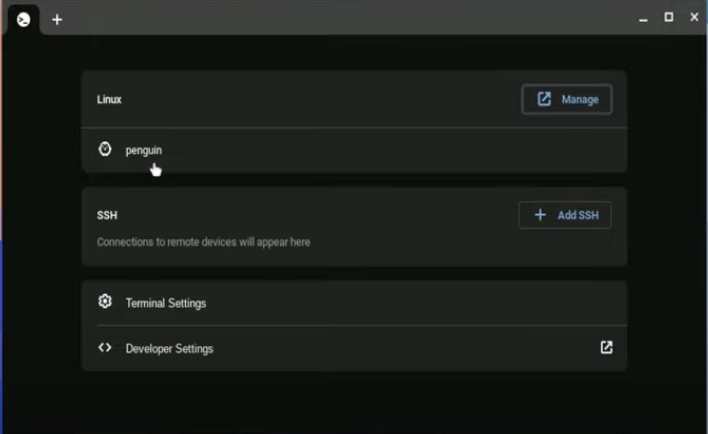
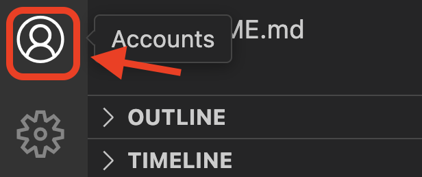
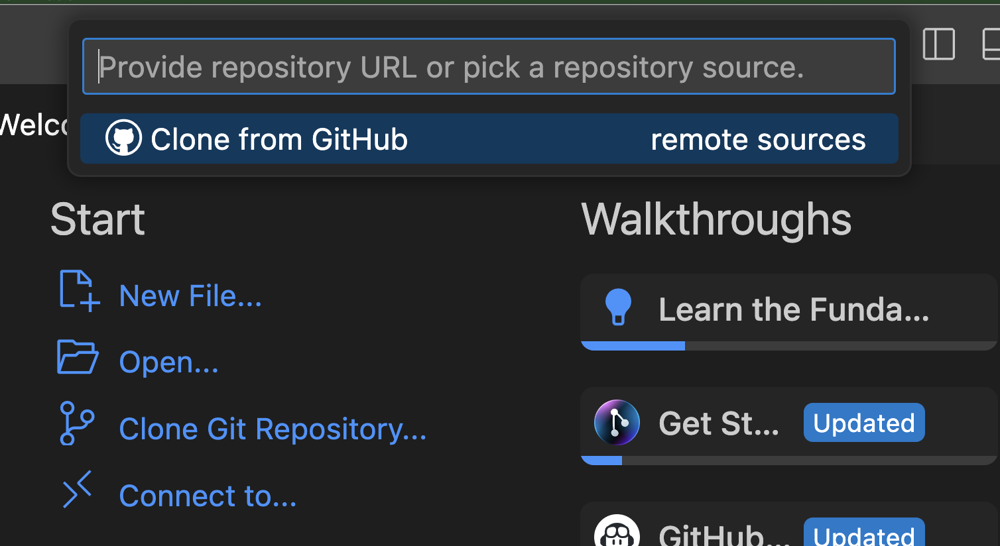

# Chromebook Setup

This guide follows the blog post here: [chromebook-get-started](https://code.visualstudio.com/blogs/2020/12/03/chromebook-get-started)

This video shows how to install and activate LINUX on Chromebook [youtube](https://youtu.be/7CKAhNIoLqY?si=F9VjFrhhUehsxP_R)

A video that shows how to install VSCode is here: [youtube](https://www.youtube.com/watch?v=zx767PNqpBA)

## Activating Development Mode

1. Go to Settings -> Developer -> Linux -> Setup Linux.
2. Specify how much space you will devote to linux. Don't use all your space for linux. Between 2 GB and 10 GB should be enough
3. When finished, terminal should open. You can also get to terminal through the Terminal App, then clicking on "Penguin" after it opens.

Note: There will be a slider for you to decide how much space you want to allocate to Linux. Don't allocate all remaining space to Linux, or you won't have enough space for other tasks (like downloading files). On the other hand, the minimum of 2GB is a little small. Choose something in the middle, and it should install just fine.

## Opening the Terminal

To open the terminal...

1. Go to Apps -> Linux apps -> Terminal
2. This will open the "Settings" of the Terminal app. Under where it says "Linux", there should be a line that says "Penguin". Clicking on "Penguin" will open the terminal.

## Installing VSCode

### Installing Gnome Keyring (optional)

First install Gnome Keyring

    sudo apt-get update
    sudo apt-get install -y gnome-keyring

If you don't have success installing Gnome Keyring, you can still use VSCode, but it will be slightly less secure when you log into GitHub.

Also if installing Gnome Keyring doesn't work, try restarting your computer.

### Downloading and installing VSCode

Next you will install Visual Studio code

You should now just download and install VSCode from the VSCode website. It is about a 100MB download.

https://code.visualstudio.com/Download

Chromebooks are Debian based, so you will need the .deb installer, not the Red Hat .rpm installer.

Download, then double click on the downloaded file install it. (If it doesn't work, try restarting your machine and double clicking it again.)

### Troubleshooting

There are some errors that could occur. One is if you download the wrong installer for your CPU. Most Chromebooks are either arm64 or amd64. You can find out which you have with this command.

In your terminal, find out if you have what your chip type is.

    dpkg --print-architecture

Then download the .deb installer for the type of chip you have. If you have an amd64 chip, or an Intel chip, you will need x86. If you have an arm64 chip, you will need arm64.

    amd64 -> x86
    arm32 -> arm32
    arm64 -> arm64

*If you've allocated all your available space to the linux partition, you might not have space for the download. So be sure you didn't use up all the space during the Linux installation stage.

And if it doesn't work the first time, try restarting and trying again.

## Post install

You should get a GitHub account and log in to GitHub with VSCode in order to be able to clone and sync your repositories.

First login to GitHub in Chrome. Then you will need to login to GitHub in VSCode.

To login to GitHub with VSCode, you need to initiate an action requires login. One such action is clicking on the Gear Cog icon at the bottom left and clicking "Setup Backup and Sync".

 Once you do that, you should see your account under the Profile icon just above it.

## Clone a repo from GitHub

Once GitHub is connected to VSCode, you can click on `Clone Git Repository...` from the Welcome screen of VSCode. Click it, then click on "Clone from GitHub...remote sources" at the top of the screen, just under the Palette bar.

This will direct you to the GitHub webpage to ask for permissions. Accept the permissions and go back to VSCode.

It should show all your repos on GitHub. Click on any one of them to clone it down to your machine.

## Setup git user.name and user.email

Once you have a repo on your machine, you can make a change, add, commit, and push.

Open a terminal in VSCode with CMD J. Then try to add, commit and push a change to your code.

When you attempt to make a commit, you will get an error telling you to set up your user name and user email. This is required so that all your commits are signed by you and you get credit or blame for each commit you make.

You will need to set the user.email and user.name before you commit. This [video](https://www.youtube.com/watch?v=hklyjZGGvFw
) shows you how do it from a terminal.

These are the commands you will need:

    git config --global user.name "My Name"
    git config --global user.email "myemail@gmail.com"

## Workflow

There are a few ways to open a repo with VSCode. The easiest way is to click "Clone GitHub repo" on the startup page of VSCode. If you are logged in to GitHub in VSCode, it will list your repos. Click on a repo to clone it, and select a download location.

In mac and windows, there will be an option to open VSCode using the command `code .` from the terminal. This may or may not work in Chromebook. But you can use the other ways, listed above to open files and folders for editing.
